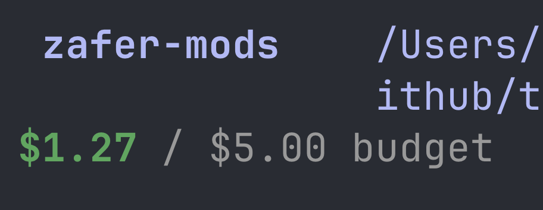

# Cost Meter

A Claude Code mod that shows what your session has cost so far, live, right above the prompt.



- **Live total.** Updates as the session spends, mid-turn too. It's the same figure `/cost` shows, subagents included.
- **Budget.** Green under half, yellow past half, red over, with a one-time warning when you cross it.
- **`/spend`.** Turns, average per turn, and your priciest turn.
- **VS Code.** The extension has no room above the prompt, so there the meter opens as a **Cost** pane instead. Run `/spend` to bring it back if you close it.

On a Pro or Max plan the figure is what the same usage would cost on the API, not what you're billed.

## Install

Requires Claude Code 2.1.287 or later.

```
/plugin marketplace add zaferayan/claude-cost-meter
/plugin install cost-meter@zafer-mods
/reload-plugins
```

## Configure

Set **Budget (USD)** for Cost Meter in `/config`. The default is $5; set it to 0 to turn the budget off.

## Develop

```
claude plugin validate ./cost-meter
claude plugin test ./cost-meter
```

A mod runs inside Claude Code with the same access Claude Code has. Read the source before you install it: it's one file, [`cost-meter/hooks/cost-meter.mjs`](cost-meter/hooks/cost-meter.mjs).
